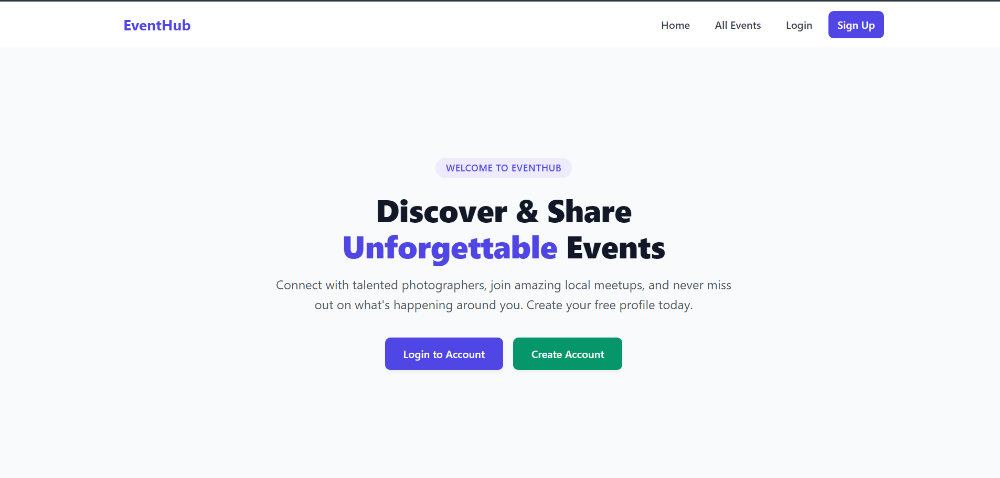
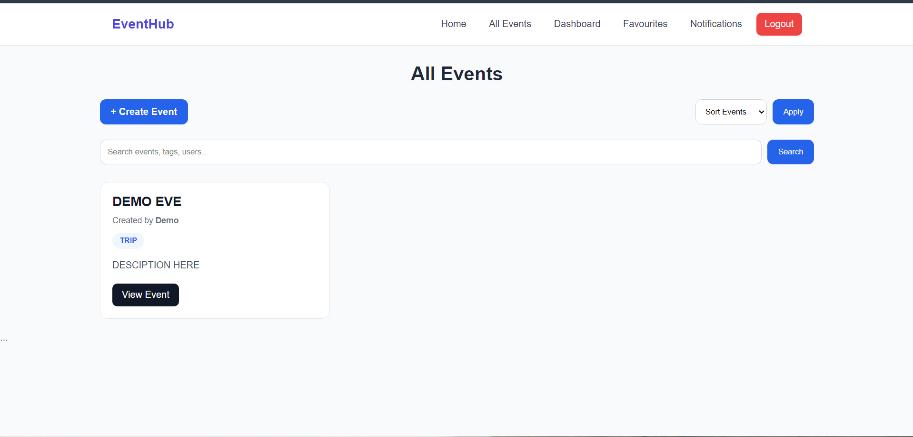
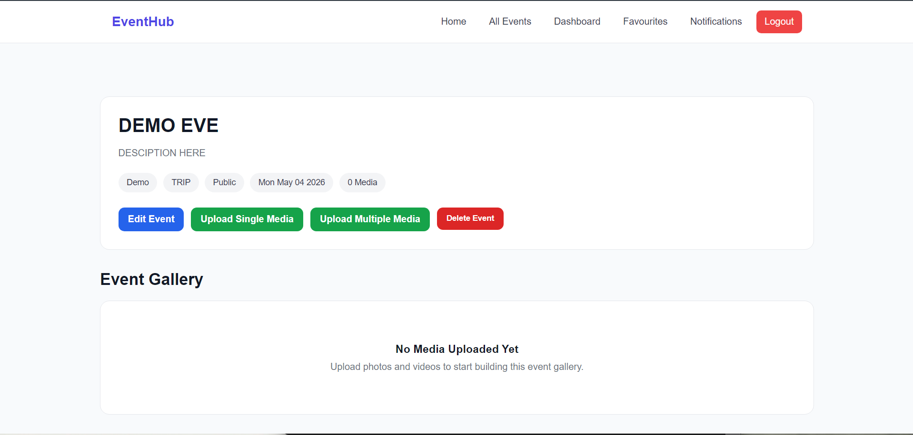
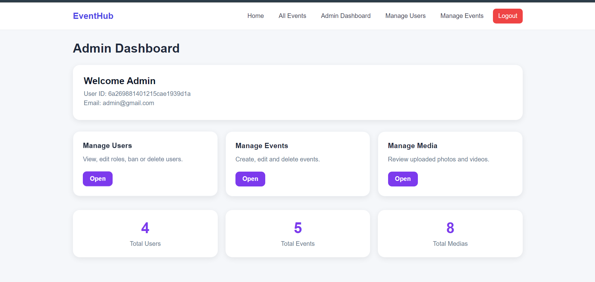

# Event & Media Management Platform

Built with Node.js, Express.js, MongoDB, AWS S3, JWT Authentication, and Render.

A centralized web platform for managing events, uploading and organizing media, controlling access through user roles, and enabling personalized photo discovery. The platform provides secure authentication, cloud-based storage, event-wise media management, facial recognition-based photo matching, watermark-protected downloads, and an admin dashboard for complete platform control.




## Table of Contents

<ol>
    <li><a href="#live-demo">Live Demo</a></li>
    <li><a href="#overview">Overview</a></li>
    <li><a href="#key-highlights">Key Highlights</a></li>
    <li><a href="#features">Features</a></li>
    <li><a href="#tech-stack">Tech Stack</a></li>
    <li><a href="#system-architecture">System Architecture</a></li>
    <li><a href="#database-schema">Database Schema</a></li>
    <li><a href="#folder-structure">Folder Structure</a></li>
    <li><a href="#installation">Installation</a></li>
    <li><a href="#environment-variables">Environment Variables</a></li>
    <li><a href="#authentication--authorization">Authentication & Authorization</a></li>
    <li><a href="#cloud-storage">Cloud Storage</a></li>
    <li><a href="#deployment">Deployment</a></li>
    <li><a href="#screenshots">Screenshots</a></li>
    <li><a href="#author">Author</a></li>
</ol>


---
## Live Demo

🔗 [Live Demo](https://eveman-platform.onrender.com)

---

## Overview

Clubs, societies, photographers, and event organizers generate a large amount of media during events such as workshops, cultural fests, competitions, trips, and photoshoots.

Managing this media across multiple cloud drives and personal folders becomes difficult over time. This platform solves the problem by providing a centralized system where events and media can be organized, accessed, searched, and managed efficiently.

---

## Key Highlights

- JWT Authentication with Role-Based Access Control
- AWS S3 Cloud Media Storage
- Facial Recognition Based Photo Discovery
- Dynamic Watermarking System
- Event-wise Media Management
- Real-Time Notifications
- Admin Dashboard for User & Event Management
- Deployed on Render

---

## Features

### Authentication & Authorization

* JWT-based Authentication
* Secure Password Hashing using bcrypt
* Protected Routes
* Role-Based Access Control (RBAC)
* Persistent Login using HTTP Cookies

### User Roles

* Admin
* Photographer
* Member
* Viewer

### Event Management

* Create Events
* Edit Events
* Delete Events
* Event Details Page
* Event-wise Media Organization
* Public and Private Events
* Event Categories
* Event Metadata Management

### Media Management

* Upload Photos
* Upload Videos
* Bulk Upload Support
* Drag & Drop Upload Interface
* Media Preview Before Upload
* Delete Media
* Download Media
* Event-wise Media Organization

### Personalized Photo Discovery

* Upload Reference Selfie
* Facial Matching System
* Automatically Find User Photos
* Personalized Gallery Section

### Watermarking System

* Dynamic Watermark Generation
* Event-based Watermark
* User Role-based Watermark
* Secure Media Downloads

### Admin Dashboard

* Manage Users
* Change User Roles
* View All Events
* Edit Events
* Delete Events
* Platform Administration

### Notifications

* Real-Time Notifications
* Like Notifications
* Comment Notifications
* Tag Notifications

### Cloud Integration

* AWS S3 Media Storage
* Secure File Management
* Scalable Cloud-Based Storage

---

## Tech Stack

### Frontend

* HTML
* CSS
* JavaScript
* EJS

### Backend

* Node.js
* Express.js

### Database

* MongoDB
* Mongoose

### Authentication

* JSON Web Tokens (JWT)
* bcrypt

### Cloud Services

* AWS S3

### Deployment

* Render

### Additional Libraries

* Multer
* Multer-S3
* Cookie Parser
* Sharp

---

## System Architecture

```text
Client Browser
       |
       ▼
Express.js Server
       |
       ├── MongoDB Database
       |
       └── AWS S3 Storage
```

---

## Database Schema

### User

```javascript
{
    name,
    email,
    profilePhoto,
    profilePhotoKey,
    faceId,
    role,
    password,
    salt
}
```

### Event

```javascript
{
    title,
    description,
    category,
    date,
    location,
    media,
    coverImage,
    visibility,
    createdBy
}
```

### Media

```javascript
{
    event,
    uploadedBy,
    url,
    key,
    tags,
    faceIds,
    likes,
    favourites,
    comments,
}
```


---

## Folder Structure

```text
project/
│
├── config/
├── controllers/
├── middlewares/
├── models/
├── routes/
├── services/
├── public/
├── views/
├── utils/
├── sockets/
├── screenshots/
│
├── server.js
├── package.json
└── README.md
```

---

## Installation

### Clone Repository

```bash
git clone https://github.com/anime024/EveMan_PlatForm.git
```

### Move into Project Directory

```bash
cd EveMan_PlatForm
```

### Install Dependencies

```bash
npm install
```

### Start Server

```bash
npm start
```

---

## Environment Variables

Create a `.env` file in the root directory.

```env
PORT=8000

MONGO_URI=your_mongodb_uri

JWT_SECRET=your_jwt_secret

AWS_ACCESS_KEY_ID=your_access_key

AWS_SECRET_ACCESS_KEY=your_secret_key

AWS_REGION=your_region

AWS_BUCKET_NAME=your_bucket_name
```

---


## Authentication & Authorization

The application uses JWT-based authentication to secure user sessions.

Security features include:

* JWT Token Verification
* Password Hashing with bcrypt
* Protected Routes Middleware
* Role-Based Access Control
* Secure Cookie Storage

---

## Cloud Storage

All uploaded media files are stored in AWS S3.

Benefits:

* High Availability
* Scalability
* Secure Storage
* Fast Media Delivery
* Reduced Server Load

---

## Deployment

The application is deployed using Render.

### Production Stack

* Frontend: EJS Templates
* Backend: Node.js + Express.js
* Database: MongoDB Atlas
* Media Storage: AWS S3
* Hosting: Render

---

## Screenshots

### Home Page


### Event Page



### Media Upload



### Admin Dashboard





---


## Author

**Animesh Raj**

Electrical Engineering
Indian Institute of Technology Roorkee

---


